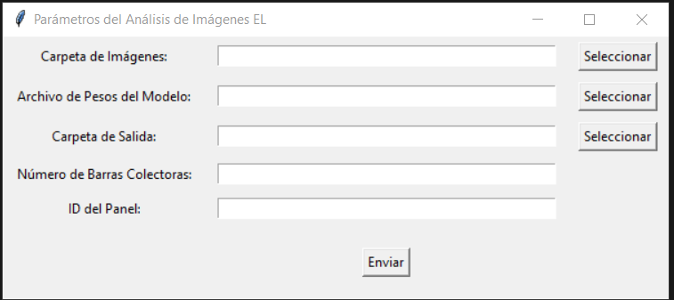

# Análisis de Imágenes EL para Celdas Solares

Este script realiza un análisis de imágenes de electroluminiscencia (EL) de celdas solares utilizando un modelo de segmentación U-Net. El análisis incluye la detección de grietas, barras colectoras y zonas oscuras en las celdas solares, y genera un reporte en PDF con los resultados.

## Requisitos

- Python 3.6 o superior
- Las siguientes bibliotecas de Python:
  - `torch`
  - `torchvision`
  - `cv2` (OpenCV)
  - `numpy`
  - `imutils`
  - `pandas`
  - `tkinter`
  - `reportlab`

Se puede instalar las bibliotecas necesarias utilizando `pip`:

```sh
pip install torch torchvision opencv-python numpy imutils pandas tkinter reportlab
```

## Uso

### 1. Configuración de Parámetros

El script utiliza una interfaz gráfica para ingresar los parámetros necesarios, como la carpeta de imágenes, el archivo de pesos del modelo, la carpeta de salida, el número de barras colectoras y el ID del panel.  


### 2. Ejecución del Script

Para ejecutar el script, simplemente se ejecuta el archivo `Predicciones.py`  

```sh
python Predicciones.py
```

### 3. Generación del Reporte

El script generará un reporte en PDF con los resultados del análisis, incluyendo:

- Imagen del panel completo con las predicciones
- Gráficos de barras de defectos y área promedio
- Estadísticas de porcentaje de área por imagen
- Matriz de coocurrencia
- Mapas de calor de las predicciones
- Estimaciones de área inactiva, longitud de grietas y nivel de brillo

El reporte se guardará en la carpeta de salida especificada.

## Estructura del Proyecto

- `Predicciones.py`: Script principal que realiza el análisis y genera el reporte.
- `unet_model.py`: Definición del modelo U-Net.
- `Funciones.py`: Funciones auxiliares utilizadas en el análisis.
- `textos_reporte.txt`: Archivo de texto con los textos utilizados en el reporte.
- `Predicciones.ipynb`: Notebook de Jupyter con el código del script.

## Ejemplo de Uso

### Parámetros

```python
# Carpeta de imágenes
imgs_path = 'D:/Documentos/Universidad de Cuenca/Trabajo de Titulación/Datasets_EL/CeldasIndividuales/Mono2_V40_I5_t28'

# Archivo de pesos del modelo
weight_path = 'D:/Documentos/Universidad de Cuenca/Trabajo de Titulación/Predicciones/PesosGColab/unetv32.pt'

# Carpeta de salida
out_path = 'D:/Documentos/Universidad de Cuenca/Trabajo de Titulación/Predicciones/SalidasMonoV4'

# Número de barras colectoras
n_busbar = 2

# ID del panel
ID_panel = 'Mono2_V40_I5_t28'
```

### Ejecución

```sh
python Predicciones.py
```

### Reporte Generado

El reporte en PDF se guardará en la carpeta de salida especificada con el nombre `reporte_analisis_EL_<fecha>_<ID_panel>.pdf`.
