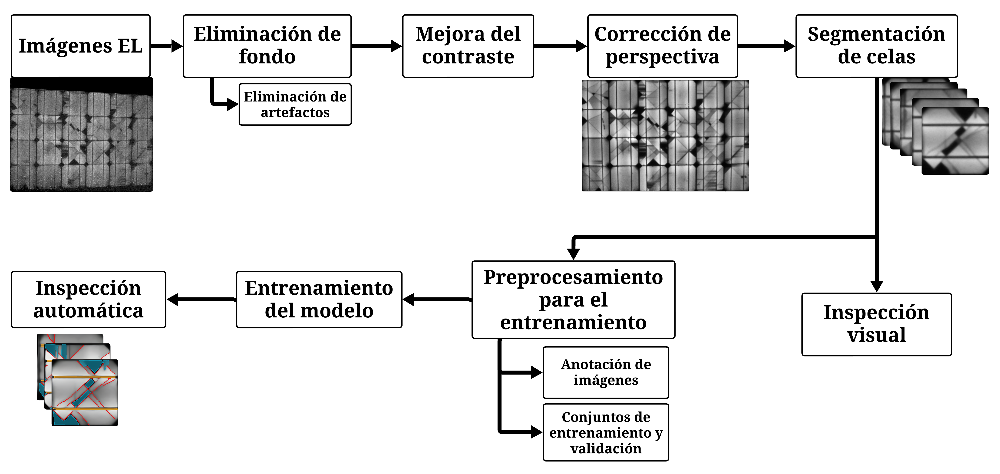

<div align="center" id="top"> 
  

  &#xa0;

  <!-- <a href="https://pvdefectdetect.netlify.app">Demo</a> -->
</div>

<h1 align="center">PVDefectDetect</h1>

<p align="center">
  

  

  

  

  <!--  -->

  <!--  -->

  <!--  -->
</p>

<!-- Status -->

<!-- <h4 align="center"> 
	🚧  PVDefectDetect 🚀 Bajo construcción...  🚧
</h4> 

<hr> -->

<p align="center">
  <a href="#dart-about">About</a> &#xa0; | &#xa0; 
  <a href="#sparkles-features">Features</a> &#xa0; | &#xa0;
  <a href="#rocket-tecnologías">Tecnologías</a> &#xa0; | &#xa0;
  <a href="#white_check_mark-requisitos">Requisitos</a> &#xa0; | &#xa0;
  <a href="#checkered_flag-comenzando">Comenzando</a> &#xa0; | &#xa0;
  <a href="#memo-license">License</a> &#xa0; | &#xa0;
  <a href="https://github.com/Franklingo13" target="_blank">Author</a>
</p>

<br>

## :dart: About ##

Proyecto para la detección de defectos en módulos fotovoltaicos a partir de imágenes de electroluminiscencia (EL), combinando preprocesamiento de imágenes y segmentación semántica con redes neuronales (U‑Net y variantes). El flujo cubre: captura, corrección geométrica/óptica, análisis a nivel de celda y evaluación del desempeño del sistema.

Resumen del trabajo:
- Adquisición de imágenes EL (p. ej., con cámara OWL 640 M).
- Pipeline de preprocesamiento: sustracción de fondo, remoción de artefactos, realce de contraste (CLAHE) y recorte a celdas.
- Segmentación semántica para detectar fisuras (cracks), barras colectoras (busbars), zonas oscuras (dark) y otros defectos.
- Evaluación objetiva (métricas, SNR) y subjetiva (visual), incluyendo matrices de confusión, mapas de errores y mapas de probabilidad (softmax).



## Características

- Preprocesamiento de imágenes EL (CLAHE, sustracción de fondo, remoción de artefactos).
- Corrección y segmentación a nivel de celda; manejo de ROI y comparativas sin deformación.
- Modelos de segmentación (U‑Net) y notebooks para evaluación y generación de métricas/figuras.
- Visualizaciones: superposición de máscaras, mapas de error (FP/FN), heatmaps de probabilidad por clase.

## Estructura principal del repositorio

- ImagePreprocessing/
  - Scripts y notebooks de preprocesado (por ejemplo: `contrast_enhancement.py`, `CorreccionImagenes.py`, `el_image_processing.ipynb`).
  - `Salidas/` con resultados intermedios (promedios, CLAHE, recortes, etc.).
- Detección_de_Grietas_y_Pruebas_de_Modelos/
  - Notebooks y modelos para segmentación (`unet_model.py`, `EvaluacionModelo.ipynb`, `Segmentacion_de_Celdas.ipynb`).
- Predicciones/
  - Utilidades de inferencia y visualización (`Funciones.py`, `Predicciones.py`, `Predicciones.ipynb`).
- EvaluationMetrics/
  - Cálculo de métricas y visualización (`evaluationMetrics.py`, `EvaluationMetrics.ipynb`).
- SNR_calc/
  - Scripts y datos para cálculo/visualización de SNR según IEC.
- docs/
  - Documentación complementaria (p. ej., `CorreccionImagenes.md`).
- Raíz del proyecto
  - Utilidades y scripts rápidos: `Aplicar_CLAHE.py`, `AplicarMMC.py`, `SubstractBG.py`, `CorreccionImagenes.py`, etc.

## Requisitos

- Python 3.10+ y pip
- Recomendado: entorno virtual (venv)

Instala dependencias (PowerShell en Windows):

```powershell
python -m venv .venv; .\.venv\Scripts\Activate.ps1
pip install -r requirements.txt
```

## Uso rápido

- Preprocesamiento:
  - `CorreccionImagenes.py` permite seleccionar carpetas de entrada y generar salidas (imágenes promedio pre/post‑CLAHE, max/min, etc.).
  - Alternativamente, usa los notebooks en `ImagePreprocessing/` para flujos guiados y análisis subjetivo.

- Entrenamiento y evaluación:
  - Explora `Detección_de_Grietas_y_Pruebas_de_Modelos/` (p. ej., `EvaluacionModelo.ipynb`).
  - Genera métricas, matrices de confusión (con exclusión opcional de clases) y mapas de error FP/FN.

- Inferencia y visualización:
  - `Predicciones/Predicciones.py` o `Predicciones.ipynb` para aplicar el modelo a nuevas imágenes y producir superposiciones y heatmaps de probabilidad (softmax) por clase.

Notas de datos: organiza tus imágenes EL (y, cuando aplique, las de fondo) en carpetas; los scripts/notebooks piden rutas de entrada y una carpeta de salida donde se guardan resultados.

## Tecnologías

- Python, Jupyter Notebook
- OpenCV, NumPy, Matplotlib/Seaborn
- PyTorch/Torchvision

## Licencia

Este proyecto está bajo la licencia MIT. Consulta el archivo [LICENSE](LICENSE).

Autor: [Franklingo13](https://github.com/Franklingo13)

&#xa0;

<a href="#top">Back to top</a>
